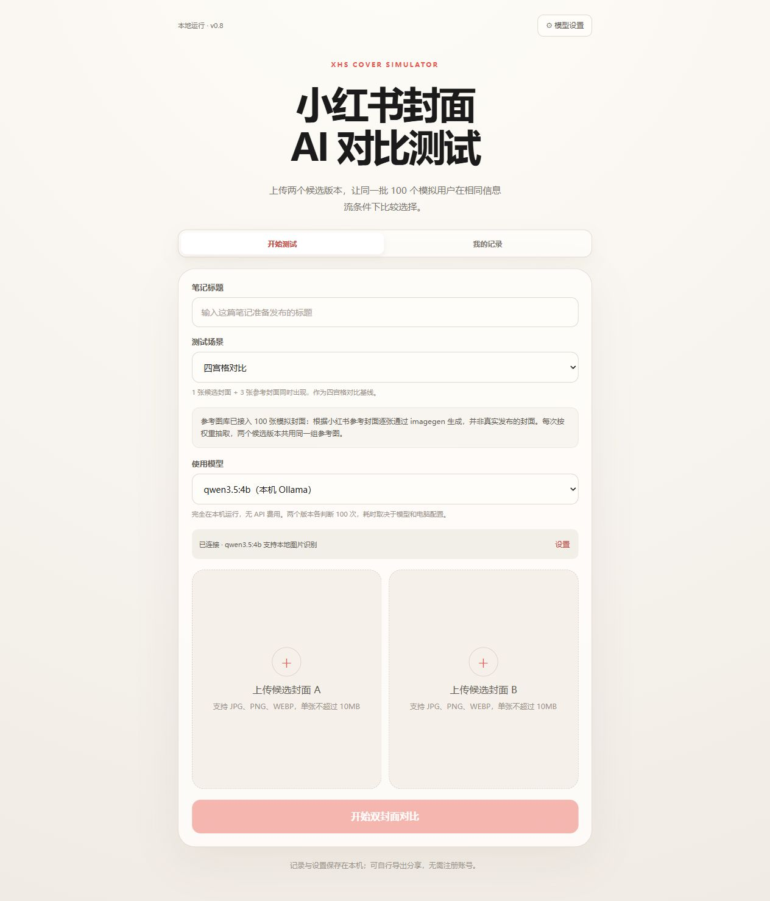
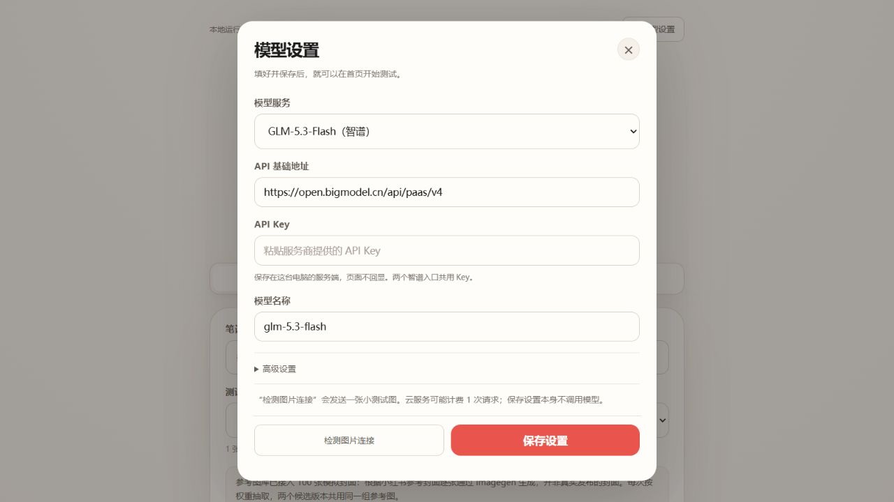
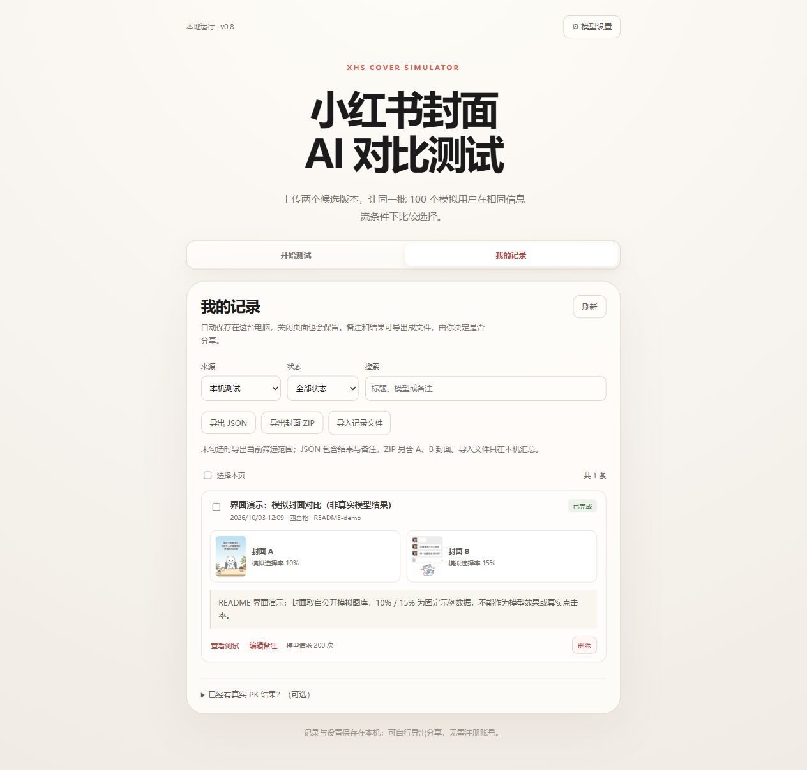

# 小红书封面 AI 对比测试

**发布前，先比较两张封面在模拟信息流中的表现。**

同一篇笔记准备了两个封面，不确定用哪张？把 **A/B 两张封面 + 同一个笔记标题** 放进这个工具，让同一批 **100 个虚拟用户画像** 分别判断两个版本，再查看各自被选中的次数、自然跳过次数和信息流预览。

工具在你自己的电脑上运行，通过浏览器操作。**无需注册账号，API Key 可以直接在页面填写，测试记录自动保存在本机。**

[快速开始](#快速开始) · [配置模型](#配置模型) · [如何看结果](#如何看结果) · [保存与分享](#保存与分享)

## 可以用它做什么

- 比较同一篇笔记的两种封面排版、配图或封面文案。
- 在四宫格或双列纵向信息流中，观察候选封面和参考封面一起出现时的表现。
- 留下测试结果和自己的备注，后续回看、导出，或主动分享给项目维护者。

结果用于提供封面选择的参考。**模拟选择率不等同于真实发布后的点击率（CTR）**；差异很小时，应结合内容和实际发布反馈判断。

### 界面预览

首页可以填写标题、选择场景和模型，并上传两个候选封面。



## 快速开始

以下步骤以 **Windows** 为例，第一次使用不需要写代码。

### 1. 安装运行环境

打开 [Node.js 官方下载页](https://nodejs.org/en/download)，选择 **24 LTS 的 Windows 安装程序（.msi）**，按默认选项安装。已经装有 Node.js 22.13 或更高版本的，可以跳过这一步。

Node.js 是运行本工具所需的软件；如果使用云模型，不需要另外安装 Ollama。

### 2. 下载并解压项目

点击 **[下载项目 ZIP](https://github.com/linsank2005/xiaohongshu-cover-simulator-public/archive/refs/heads/main.zip)**，也可以在本仓库页面点击绿色 **Code → Download ZIP**。

解压后，打开包含 `README.md` 和 `start-windows.cmd` 的文件夹。**先解压，再启动。**

### 3. 双击启动

双击 **`start-windows.cmd`**。首次启动会联网安装依赖、准备页面，完成后自动打开浏览器，请保留启动窗口。

通常打开的地址是 **http://127.0.0.1:3001**。端口被占用时会自动使用 3002–3010 中的空闲端口，以启动窗口显示的地址为准。

### 4. 配置模型，再开始测试

点击页面右上角 **“模型设置”**，按照下一节选一种方式配置。完成后回到首页，输入标题、上传两张封面，点击 **“开始双封面对比”**。

以后使用时，直接双击 `start-windows.cmd` 即可。结束使用时，在启动窗口按 `Ctrl+C` 停止工具。

## 配置模型

模型负责看图并模拟用户选择。**本地模型和云 API 任选一种，不需要两种都配置。**

| 方式 | 需要准备 | 适合的情况 |
| --- | --- | --- |
| 本机 Ollama | 安装 Ollama，下载支持图片识别的模型 | 想在自己电脑上推理，不使用云 API |
| 云模型 API | 服务商提供的 API Key、支持图片输入的模型 | 已有 API，或不想下载本地模型 |

### 方式一：本机 Ollama

1. 在 **“模型设置”** 中选择 **“Ollama · 本机模型”**。
2. 点击 **“下载安装 Ollama”**，完成官方应用的安装；已经安装的可以跳过。
3. 点击 **“启动 Ollama”**，再点 **“刷新已安装模型”**。
4. 选择列表中支持图片识别的本地模型。没有模型时，可以填写 `qwen3.5:4b` 并点 **“下载模型”**，等待完成后选择它。
5. 点击 **“检测图片连接”**，检测通过后点 **“保存设置”**。
6. 回到首页，在 **“使用模型”** 中选择这个本机入口。

Ollama 地址默认是 `http://127.0.0.1:11434`，通常无需修改。本机入口无需 API Key，支持其他本地视觉模型；纯文字模型无法用于看封面。

本地推理不产生云 API 费用，速度取决于电脑配置和模型大小。模型下载可能需要较长时间，窗口会显示进度，停止后可以继续下载。更多安装说明见 [Ollama 官方快速开始](https://docs.ollama.com/quickstart)。

### 方式二：云模型 API

1. 在 **“模型设置”** 中选择对应的服务入口，页面提供智谱和 DeepSeek 等入口。
2. 填写服务商提供的 **API 基础地址、模型名称、API Key**。使用默认服务地址时，通常保留地址即可。
3. 确认所选模型支持 **图片输入**，点击 **“检测图片连接”**。
4. 检测通过后点 **“保存设置”**，回到首页选择同一个服务入口。



*上图展示配置入口；具体模型是否可用，以服务商的图片能力和连接检测结果为准。*

API Key 保存到这台电脑的本地数据库，已有密钥不会回显。日常使用无需修改配置文件。检测连接会发送一张小测试图；完整 A/B 测试通常需要 **200 次模型请求**，费用按服务商规则计算。云模型会接收到用于测试的封面和标题。

## 完成第一次测试

1. 准备 **同一篇笔记的两张候选封面**。支持 JPG、PNG、WEBP，单张不超过 10MB。
2. 在首页填写这篇笔记准备发布的 **同一个标题**。
3. 选择测试场景：
   - **四宫格对比**：一张候选封面和三张参考封面同时出现，适合作为第一次测试的起点。
   - **纵向信息流对比**：一张候选封面和九张参考封面，排列成双列五行。
4. 选择已配置好的模型，上传 **封面 A** 和 **封面 B**。
5. 点击 **“开始双封面对比”**，等待判断进度完成。需要中止时，可以点击 **“取消测试”**。

两个版本共用同一批画像、同一组参考封面和位置安排，分别接受 100 次判断。虚拟用户既可以选择候选或参考封面，也可以选择自然跳过。一次完整测试合计 200 次判断，耗时取决于模型和电脑配置。

## 如何看结果

完成后，可以看到各版本的 **模拟选择率、被选中次数、自然跳过次数**，以及模型看到的信息流示例。


*上图是界面演示：使用本仓库的模拟封面和固定示例响应生成，模型标记为 README-demo，不是模型效果或准确率证据。*

例如，示例中的 A 为 `10/100`（10%）、B 为 `15/100`（15%），表示在各自的 100 次判断中，候选封面分别被选中了 10 次和 15 次。**不表示真实发布后会有 10% 或 15% 的点击率。**

可以把模拟结果作为选择封面的参考，并在 **“我的记录”** 添加自己的观察。失败或取消的测试会保留已完成的判断，不会被当作完整结果。

## 保存与分享

测试记录自动保存在 **这台电脑的项目目录中**，关闭页面或重启后仍可查看。打开 **“我的记录”**，可以搜索、添加备注、查看结果或删除已结束的记录。



*上图与结果页使用同一条界面演示记录，数值不是模型实测。*

### 想把测试记录反馈给维护者

1. 在 **“我的记录”** 中勾选你愿意分享的记录。
2. 选择一种导出方式：

   | 按钮 | 文件内容 |
   | --- | --- |
   | **导出 JSON** | 测试统计、模型信息、标题和备注，不含封面图片 |
   | **导出封面 ZIP** | 上述记录 + 对应的 A/B 封面图片 |

3. 检查导出的文件，再通过你和维护者约定的方式发送。

没有勾选记录时，会导出当前筛选范围。导出的文件不含 API Key、模型服务地址或本机绝对路径；标题、备注和自选图片可能包含你自己的信息，请自行决定分享范围。

维护者拿到文件后，可以点击 **“导入记录文件”**，在自己的电脑上查看和汇总。工具无需登录，也不会自动上传测试记录。**反馈时只发送页面导出的 JSON/ZIP，不要发送整个 `data` 目录或本地数据库，其中可能包含你的 API Key。**

如果已有小红书真实封面 PK 结果，可以在记录页底部展开 **“已经有真实 PK 结果？（可选）”** 补充真实赢家；正常使用、记录和导出不需要填写这项。

## 常见问题

| 问题 | 处理方式 |
| --- | --- |
| 双击后提示没有 Node.js | 安装 Node.js 24 LTS，安装完成后重新双击启动。 |
| 第一次启动很久还没打开页面 | 正在安装依赖或构建，保持联网并查看启动窗口的提示；报错时按提示处理后重试。 |
| 浏览器没有自动打开 | 复制启动窗口显示的本机网址，在浏览器打开。 |
| Ollama 连接不上 | 先启动 Ollama 应用，核对地址，再刷新模型列表；也可在终端执行 `ollama serve`。 |
| 模型列表为空，或提示不支持图片 | 下载本地视觉模型；已有纯文字模型不能用于封面测试。 |
| 云模型检测失败 | 核对 Key、地址、账户额度及模型图片能力；接口能聊天不代表能看图。 |
| 测试比较慢 | 每张封面需要 100 次判断，查看页面进度；本地大模型会更慢，可按需调整超时。 |
| 关闭网页后记录还在吗？ | 在。重新启动同一份项目，打开“我的记录”即可查看。升级源码时保留自己的 `data` 目录。 |
| 不同测试的结果有变化 | 参考图会重新抽取，模型判断也可能波动；不要把一次很小的领先当作确定结论。 |

## 模拟参考图库与许可

项目内置 **100 张模拟参考封面**，逐张以小红书参考封面为参考，通过 imagegen 重新生成画面和文案，并经过确认后接入。它们 **并非真实发布的封面**；本仓库没有迁入原始封面图片、原笔记链接或原仓库的 Git 历史。

这些图片用于构建模拟信息流。一次测试会从图库中抽取 3 张或 9 张，抽样权重属于实验配置，不表示图片的真实传播效果，也暂未按主题或相似度匹配。

代码采用 [MIT 许可](LICENSE)。模拟素材范围见 [素材说明](ASSETS.md)，依赖许可见 [第三方说明](THIRD_PARTY_NOTICES.md)。可以查看 [完整模拟图库与生成记录](previews/generated-reference-library/README.md)。

## 开发与更多说明

日常使用按上面的双击启动步骤操作即可。需要开发或维护时，可执行：

```powershell
npm install
npm run dev              # 开发服务，默认 http://127.0.0.1:3000
npm test
npm run typecheck
npm run build
npm run start            # 构建后启动，默认 http://127.0.0.1:3000
npm run test:integration # 本机 mock 模型，不调用付费 API
```

`npm run launch` 与 Windows 双击入口使用相同的启动流程。维护者可在验证、提交后执行 `npm run release:bundle` 制作分发 ZIP；包中不包含个人数据、密钥、依赖或构建产物。上传 Release 是单独的发布操作。

上传图、数据库和结果保存在本机 `data` 目录下，已被 Git 忽略。工具按本机单人使用设计，请通过本机回环地址访问。

- [本地使用、记录交换与分发说明](docs/local-use-and-distribution.md)
- [当前迁移状态](docs/migration-status.md)
- [版本交付检查记录](docs/release-verification.md)
- [开发指引与验证方案](docs/development-guidance-and-validation-plan.md)
- [开源与真实数据贡献方案](docs/open-source-and-data-contribution-plan.md)（在线平台和积分属于早期规划，此版未实现）
