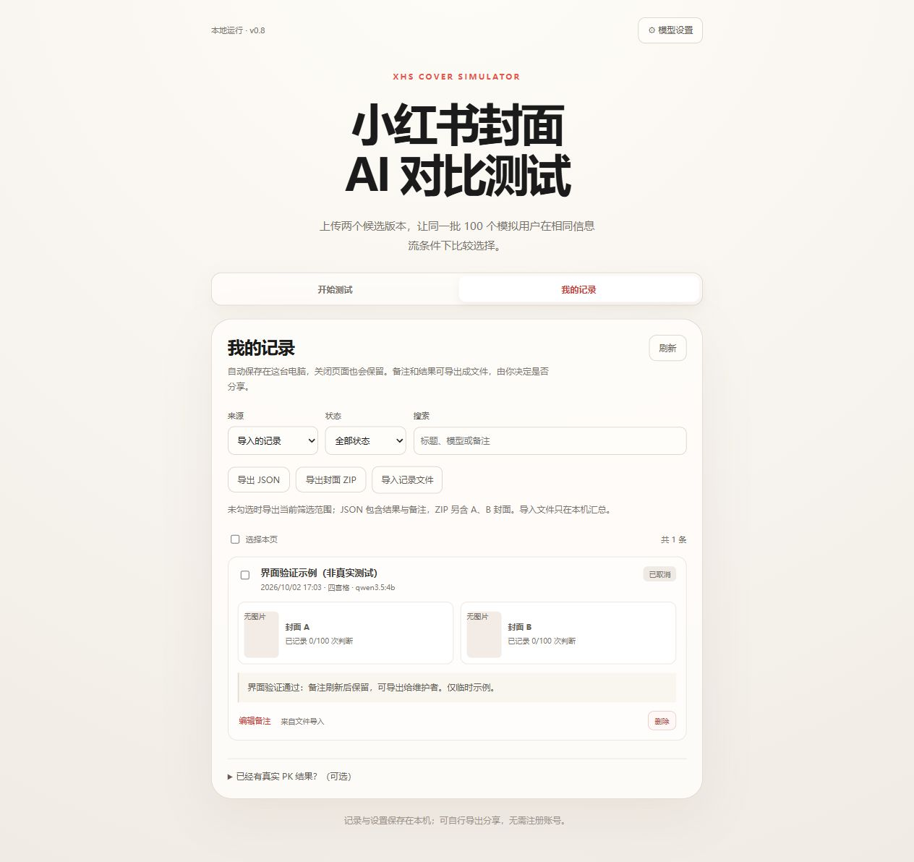

# v0.8.0 交付检查 · 2026-10-02

## 通过的检查

- `npm test`：71 项通过，包括 SQLite 多进程初始化和写入、固定模型配置、脱敏、取消、请求预算、跨来源 JSON/ZIP 导入、图片校验、重复导入和本机日期显示。
- `npm run typecheck`、生产构建：通过。
- `npm run test:integration`：通过完整四宫格和纵向 A/B 流程、200 次判断、实时判断进度、请求与 token 账本、设置锁、备注和文件交换、失败/取消删除及重启恢复。模型由本机 mock 响应，没有调用付费 API。
- `npm audit --omit=dev`：本次检查未报告已知依赖漏洞。
- Windows 启动入口实际完成依赖安装、构建和启动；再次运行复用 `127.0.0.1:3001` 的同一服务。
- 浏览器验证模型设置、Ollama 列表、保存配置、导入示例、编辑备注、刷新保留、导出 JSON 并核查下载文件。
- 通过网页检测实际本机 `qwen3.5:4b` 图片连接，耗时 17.4 秒。完整云模型及下载流由自动测试的本机 mock 验证，本次未重新下载模型权重或执行付费云模型测试。

## 数据与发布范围

原项目与原始参考封面没有改动。新仓库原有的 4 条测试记录保留；界面验证使用的临时外部示例已删除。GitHub 仓库仍为 private，本次没有公开仓库或发布在线数据服务。

分发源码包含启动入口、完整代码、提示词、正式 100 张模拟封面、测试、生成记录、文档和许可。分发包内容与 SHA-256 校验文件通过 `npm run release:bundle` 生成；不包含 Git 历史、密钥、本地数据库、用户上传内容、依赖或构建产物。

## 界面预览

设置页中的 Key 字段为空；记录页使用明确标注“非真实测试”的临时示例。截图是功能演示，不是模型效果或准确率证据。

