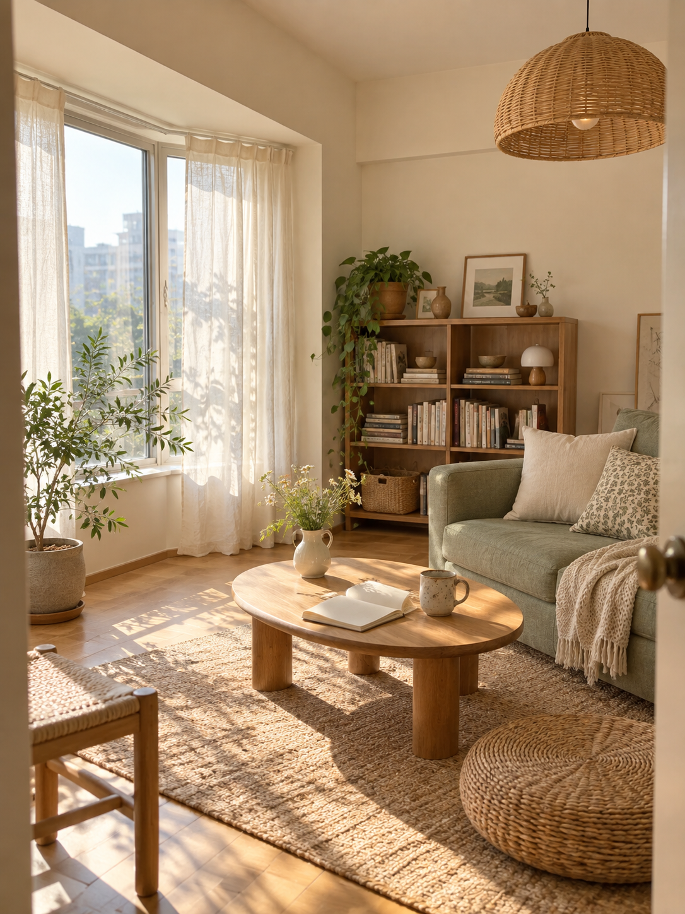

# 模拟参考封面样图 · 待确认

这 3 张样图通过内置 imagegen 新生成，尚未获得用户确认。它们保存在预览目录，未进入模拟测试竞争池。

| 编号 | 内容 | 参考的通用风格 | 生成时重新设计的内容 |
| --- | --- | --- | --- |
| 01 | 职场图文 | 浅色底、大字标题、人物插画 | 标题、短发人物、配色、办公场景及构图 |
| 02 | 家居摄影 | 暖光、生活感、自然材质 | 房间布局、沙发、窗户、家具及拍摄视角 |
| 03 | 旅行摄影 | 山水层次、薄雾、安静氛围 | 山形、湖岸、栈道、前景及光线 |

## 图片

## 生成与检查记录

- 工具：内置 imagegen，3 次独立生成。
- 原开发项目中的 3 张封面仅作为风格参考输入；原图片、路径和原笔记信息未写入本仓库。
- 完整提示词、图片尺寸和文件校验值见 [样图清单](manifest.json)。
- 职场样图主标题和底部短句经人工视觉检查，内容可读；家居和旅行样图为无主标题的摄影类封面。
- 待用户确认：整体相似程度、摄影真实感、文字可读性，以及是否按这类多样化风格扩展完整图库。

本轮停在样图确认。接入完整图库和公开发布由后续步骤完成。
