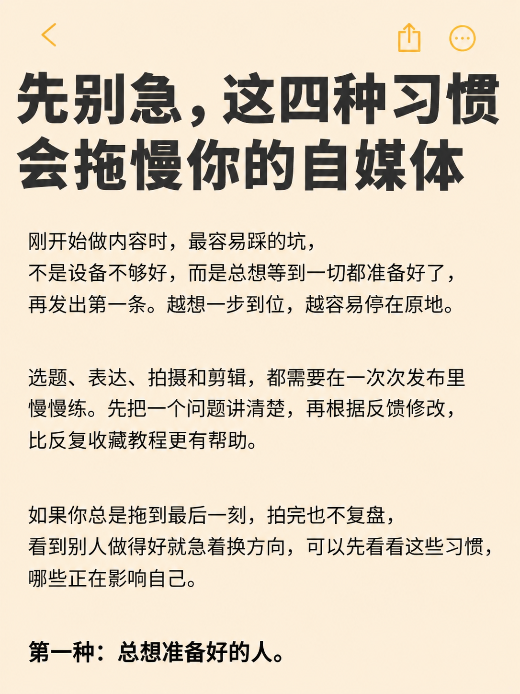
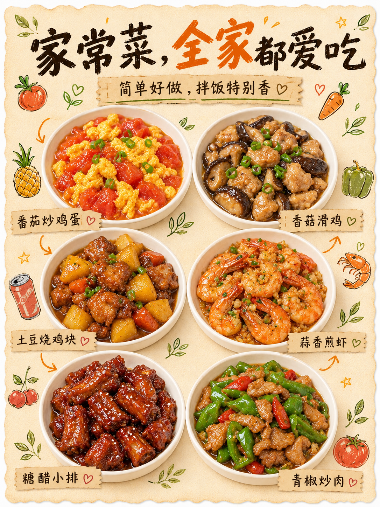

# 逐张参考原稿生成的 5 张样图 · 待确认

这些图片是根据既有小红书封面作为参考，由内置 imagegen 生成的模拟示例，并非实际发布的小红书封面。

本轮采用 5 次独立生成，每次只输入一张对应的原封面，保留其主要排版、文字密度、配色和主体位置，再改写文案、重新生成画面。原图仅在原开发目录用于生成与对照；本仓库不保存原图、原图路径或原笔记链接。

| 编号 | 类型 | 参考编号 | 保留的版式 | 调整的内容 |
| --- | --- | --- | --- | --- |
| 01 | 好物 | ref-001 | 奶黄底、三行棕色大字、绿色高亮、右下角小角色 | 种草好物文案、角色表情和姿态 |
| 02 | 自媒体 | ref-007 | 米色备忘录、两行大标题、三段正文、底部小标题 | 标题、正文和底部短句 |
| 03 | 健身 | ref-008 | 粉色底、两行黑色大字、横向平板支撑插画 | 标题、人物绘制细节 |
| 04 | 职场 | ref-018 | 灰白底、两行大标题、正面职场人物插画、底部序号短句 | 标题、底部短句、人物头发与办公室细节 |
| 05 | 美食 | ref-019 | 奶黄纸张拼贴、手写标题、两列三行白盘菜品、撕边标签 | 标题、副标题、六道菜和对应标签 |

## 图片

## 生成与检查记录

- 工具：内置 imagegen；每张图片各使用一张原稿作为参考输入。
- 完整提示词、参考编号、图片尺寸和 SHA-256 校验值见 [样图清单](manifest.json)。
- 已逐张视觉核对标题、主要元素位置和版式；美食样图另核对六盘菜与标签的对应关系。
- 自动检查覆盖文件解码、尺寸比例、文件校验值、五个不同参考编号和预览隔离状态；视觉相似程度由用户确认。
- 此前的 [3 张样图](../reference-cover-samples/README.md) 已被本轮替代，保留为过程记录。

本轮停在这 5 张样图的确认阶段，尚未接入参考图库。
